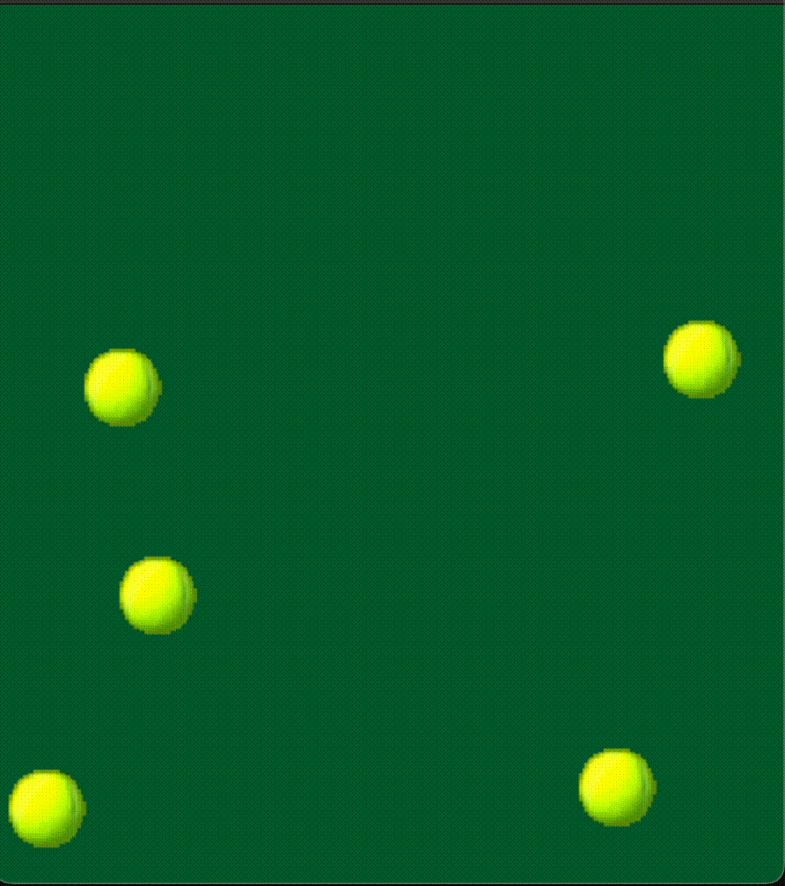

# AUTOMATIC TENNIS BALL SOUNDS

Small `pygame` program to bounce tennis balls around the frame and trigger delightful tennis ball sounds on impact with boundaries. Non-interactive.

# TO RUN

- initialize a `pygame` environment using `poetry` or however you like.
- `python scripts/main.py`

# DEPENDENCIES

- python = "^3.11"
- pygame = "^2.5.2"

# LOOKS LIKE THIS

